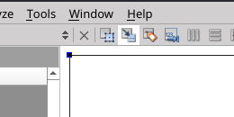

# DSBA Introduction to Programming // Workshop 32
Spring semester 2021/22

# Qt Signals and Slots


Signals and slots are the main tool for adding interactivity to your Qt application. They work the following way:

1. An interactive widget (a button) receives user input (a click).
2. The widget generates a signal ("button has been clicked").
3. Some widgets are listening to such signals, they have slots (functions) connected to them.
4. When the slot receives a signal, it runs, performing its action.

A more concrete example would be a function `printHello()` that prints a message `"Hello"` to the console whenever a button is pushed. To implement this you need:

1. A signal `clicked()` for the button.
2. The slot, which in this case may be function `printHello()` itself.
3. A way to connect the signal and the slot.

The signal is an internal Qt function, you don't need to implement it, you only need to reference it by its name when you connect it to a slot.

The slot is a regular C++ function:

```cpp
void printHello()
{
    std::cout << "Hello";
}
```

The only problem is connecting the two.

## Connecting signals and slots

There are several ways of connecting signals and slots: by name, using UI tools, with code.

### Connecting by name (not recommended)

Qt analyzes names of your methods. If you name a function `on_widgetName_signalName()` (for example, `on_pushButton_clicked()`), it will automatically connect this function to the corresponding signal. For the `printHello()` example it means that if you write code like this:

```cpp
void on_pushButton_clicked()
{
    std::cout << "Hello";
}
```

it will automatically connect it to a signal and you don't need to do anything else.

You can do the same thing via Design interface if you right-click the widget with the signal (a button), select "Go to slot..." and choose the slot you need.

However, this is an outdated way of connecting signals and slots and it's easy to make errors when you use it.

### Using GUI tools (Qt Creator or Qt Designer)

Design mode in Qt Creator has a button that allows you to edit signals and slots. Its the second (highlighted) button on the image below.



After you click this button, you enter the mode of editing signals and slots. While in this mode, click on the widget with the signal (a button) and drag it to the widget with the slot (usually the main window, in this case you drag it outside of the preview of your application).

Select the signal on the left in the menu that appears. Click "edit" on the right and add a new slot. Make sure that function prototypes are the same! If a signal takes an integer, your slot also has to take an integer.

Now if you use a function with exactly the same name and prototype as the one in your slot, it will be automatically connected to the signal.

### QObject::connect()

You can manually connect a signal and a slot using a line of code like this.

```cpp
    QObject::connect(spinBoxLevels, SIGNAL(valueChanged(int)), MainWindow, SLOT(setLevelsSlot(int)));
```

Here `spinBoxLevels` is the name of the widget with a signal, `valueChanged(int)` is the name of the signal (with the input type!), `MainWindow` is the name of the widget with the slot and `setLevelsSlot(int)` is the name of the slot-method (with the type, too!).

For the `printHello()` example it will look like this:

```cpp
    QObject::connect(pushButton, SIGNAL(clicked()), MainWindow, SLOT(printHello()));
```

# Tasks

## Task 1. Hello, world.

Examine the project ex1_hello_world or create a new Qt Widgets project.

### Designer

Modify the interface using Qt Designer. Add a button and change its label text.

### Code

Modify the interface using code. Change some text (button label, text label, window title) to something else.

Change font size for text label to 10.

To change font size:

1. Save current font to a `QFont` variable with the method `->font()`.
2. Use `setPointSize()` to change its size.
3. Use `setFont(newFont)` on the label to set the new font.

## Task 2. Rendering.

### Introduction

Examine the project ex2_cantor. This project contains several new concepts:

1. Defining your own custom widgets - `RenderArea`.
2. Drawing - `QPainter`.
3. User interactions - signals and slots.


`RenderArea` is a new class derived from `QWidget`. Whenever you need to make a custom version of a standard widget, you can make a new class like this.

Generally, it's better to choose the closest base widget to the class you want to define. For example, derive a class from `QPushButton` if you want to make a custom button class, or from `QLineEdit` if you want to make an input field with a single line of text.  
In this case it's a `QWidget`, so it's a general purpose widget.

When you make your class, you must make a constructor that takes `QWidget* parent` as input, so you can add your class to the parent-child UI hierarchy.

As your class is a custom one, it doesn't exist in Designer, so you can only add it to the program through code, manually.

A `QPainter` object can be used to draw graphical primitives (lines, rectrangles, circles) in Widgets. There is an example in `renderarea.cpp` that draws two levels of the Cantor fractal.

User interaction will be considered on later workshops.

### Tasks

#### 2.1

Make a function `drawCantor(...)` that draws a specified number of levels of the Cantor fractal. Replace the existing drawing code with the function.

#### 2.2

Make a variable field in `RenderArea` that controls the height of the rectangles in the fractal.

Test that changing this variable (in the code itself) changes how the fractal is drawn.

#### 2.3

Add another SpinBox widget that will control the height of the rectangles in the fractal.

Use signals and slots to connect spin box widgets with their respective variables.

Test that you can change the appearance of the fractal by interacting with spin boxes.

**Add limits on spin box inputs. Maximum number of levels should be 4-5. Maximum size should allow the fractal to fit the window. Size and levels can't be negative.**


### 2.4

Add a new signal-slot connection using the "QObject::connect()" method or convert an existing one to this method.
